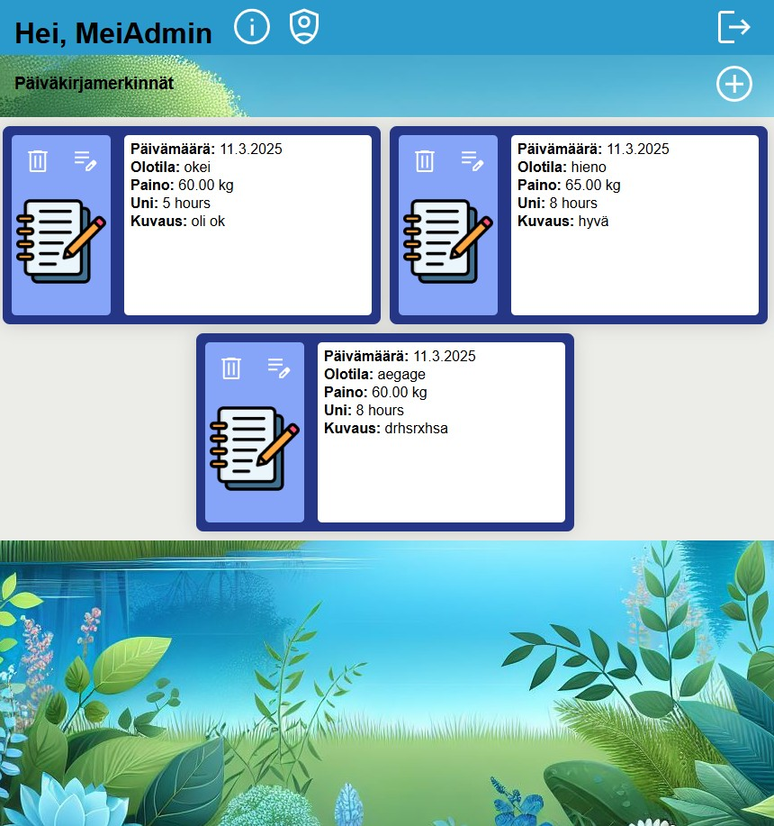
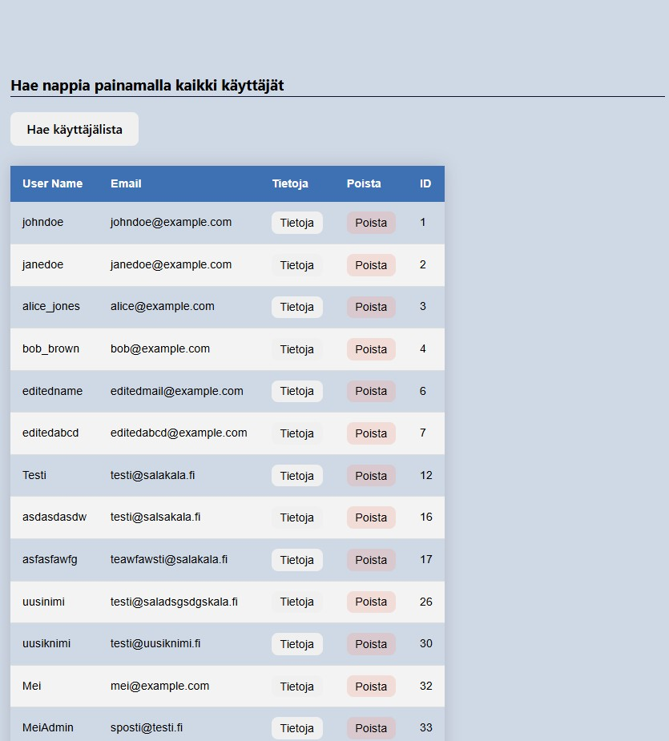

# Päiväkirjasovellus

Tämä sovellus on yksinkertainen päiväkirjasovellus, joka mahdollistaa käyttäjien rekisteröitymisen, kirjautumisen ja päiväkirjamerkintöjen hallinnan. Sovellus on rakennettu käyttäen Node.js:ää ja Express.js:ää, ja se tarjoaa RESTful API:n käyttäjien ja merkintöjen hallintaan.

## Tietokannan kuvaus

Sovellus käyttää MySQL-tietokantaa käyttäjien ja päiväkirjamerkintöjen tallentamiseen. Tietokannassa on kaksi päätaulua:

### Taulut

1. **Users**
   - `user_id`: Käyttäjän ID (automaattisesti generoitu)
   - `username`: Käyttäjänimi
   - `password`: Salasana (hashattu)
   - `email`: Sähköpostiosoite
   - `created_at`: Käyttäjän rekisteröitymispäivämäärä
   - `user_level`: Käyttäjän taso (esim. admin, user)

2. **DiaryEntries**
   - `entry_id`: Merkinnän ID (automaattisesti generoitu)
   - `user_id`: Käyttäjän ID (viite Users-tauluun)
   - `entry_date`: Merkinnän päivämäärä
   - `mood`: Mieliala
   - `weight`: Paino
   - `sleep_hours`: Unen määrä tunteina
   - `notes`: Muistiinpanot

## Toiminnallisuudet

Sovellus tarjoaa seuraavat toiminnallisuudet:

### Käyttäjien hallinta

- **Rekisteröityminen**: Uuden käyttäjän luominen.
- **Kirjautuminen**: Käyttäjän autentikointi JWT-tokenin avulla.
- **Käyttäjien haku**: Kaikkien käyttäjien tietojen haku (admin-käyttäjille).
- **Käyttäjän haku ID:llä**: Yksittäisen käyttäjän tietojen haku ID:n perusteella (admin-käyttäjille).
- **Käyttäjän muokkaus**: Käyttäjän tietojen päivittäminen.
- **Käyttäjän poisto**: Käyttäjän poistaminen ID:n perusteella (admin-käyttäjille).

### Päiväkirjamerkintöjen hallinta

- **Merkinnän lisääminen**: Uuden päiväkirjamerkinnän luominen.
- **Merkintöjen haku**: Kaikkien kirjautuneen käyttäjän merkintöjen haku.
- **Merkinnän muokkaus**: Päiväkirjamerkinnän päivittäminen ID:n perusteella.
- **Merkinnän poisto**: Päiväkirjamerkinnän poistaminen ID:n perusteella.

### Virheenkäsittely

- **404 Not Found**: Käsittelee 404 Not Found -virheet.
- **Yleinen virheenkäsittely**: Käsittelee kaikki muut virheet ja palauttaa sopivan virheviestin.

## Asennus ja käyttöönotto

1. Asenna tarvittavat riippuvuudet:
   ```bash
   npm install

2. Käynnistä palvelin
   npm run dev

3. Palvelin kännistyy osoitteessa
   Backend:
   http://127.0.0.1:3000/
   Frontend:
   http://127.0.0.1:5173/

API-dokumentaatio
   Api-dokumentaatio on saatavilla osoitteessa
   http://127.0.0.1:3000/api

### Lisätiedot
   Koodi pohjautuu osittain kurssien materiaaleihin ja tehtäviin.

### Kuvia käyttöliittymästä
  
  

